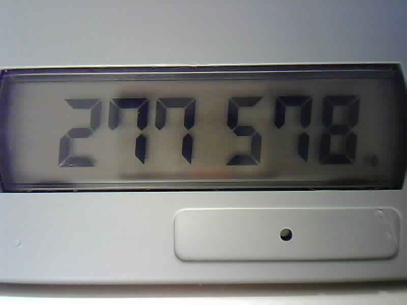
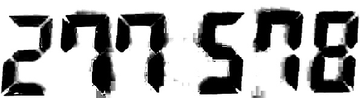
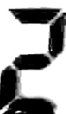
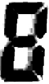

# SegoDec

Simple, reliable seven-segment OCR using OpenCV

## About

My primary aim was to be able to read and decode a simple seven-segment display ony my RSA token with the following assumptions about the display:

* Known number of digits.
* The image is positionally stable and has stable lighting.
* No decimals or other exotic characters.

I was having issues using the `ssocr` project being unreliable and slow. It was highly dependent on lighting and often failed unless tuned exactly right.

I figured that, given the limitations specified above, the actual process of decoding/reading the image is, in practice, simple. My method is as follows:

1. Crop the image such that the characters have very little excess margins.
2. Process the image to maximize contrast of the characters against the backdrop (CLAHE + brightness contrast, though optionally erosion and other morphological filters can be applied).
3. Cut up the image based on character width and inter-character distances. The inter-character distance can be specified per-character, as at least in the display I was decoding, some characters were farther apart than others.
4. Establish a mean pixel value with a certain window size (e.g., 4x4 window) to reduce noise for a certain number of test points for each possible segment.
5. Compare the pixel values against a threshold to determine which segments are on or off.
6. Compare the arrangement of on and off segments against a table of known arrangements.
7. Return the value of each character based on which digit is matched in the reference table.

This method is much faster and much more reliable than I was ever able to achieve with `ssocr` or other approaches.

## Usage

I did not spend a lot of time making adding a configuration interface (CLI, etc), so any changes to the configuration need to be done in `segodec.py`.

**Note:** The screen I used was black characters on white background. If you're using bright characters on a black background, enable `Invert` parameter described below.

Configuration values:

* `NumChars`: Number of digits to decode in screen.
* `CropX`/`CropY`/`CropW`/`CropH`: the x,y and width, height of the crop window. See example images below for how to best do this.
* `ThresholdPct`: The threshold value (0.0-1.0) to determine if a pixel is on or off.
* `Invert`': Set to `True` if you are using a **bright character** on **dark background**.
* `CharStartX`/`CharStartY`: The X,Y coordinate (from top-left) of the corner of the first character. Set to `0, 0` if your crop is very close.
* `CharHeight`/`CharWidth`: The width and height of each digit/character (gets cropped out individually).
* `CharSpacing`: A tuple `NumChars-1` long describing the distance between one-char and another in pixels.
* `SegmentTestPoints`: A set of tuples of (x,y) pixel coordinates for each of the 7 segments, from which a mean pixel value is dervied.
* `TestWindowSize`: The size of the NxN window from which a mean pixel value is determined for each of the test points described in the line above.
* `UseFuzzy`: This activates a mode which returns the closest-matched digit rather than an exact match. If disabled, if an exact match is not found, "indeterminate" is returned instead of the decoded numbers.

**NOTE**

You may need to modify the `SegmentMask` table if your segments are not configured to be active for each digit as mine is. The segments are numbered as such:

        ####          0 0
       #    #       5     1
       #    #       5     1
        ####   ==>    6 6
       #    #       4     2
       #    #       4     2
        ####          3 3

To process and image, all you need to do is run:

`python3 segodec.py [img]` 

Where `[img]` is the path to the input image. Any standard format used by OpenCV's `imread` should be fine... jpeg, png, bmp, etc.

## Example Images

#### Input Image:

#### Cropped & Processed:

#### Cut-up Digits:

 
